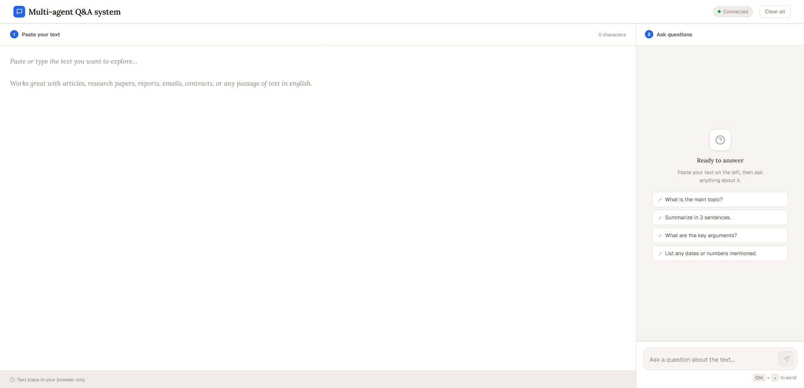
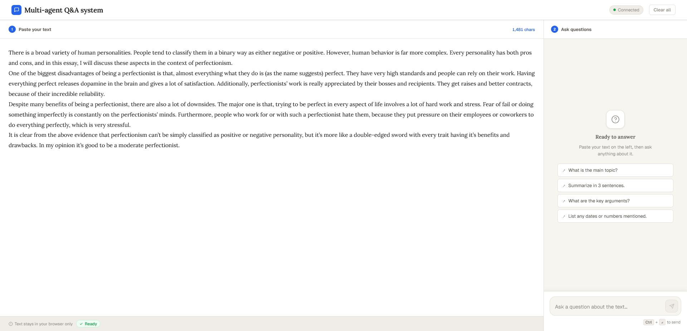
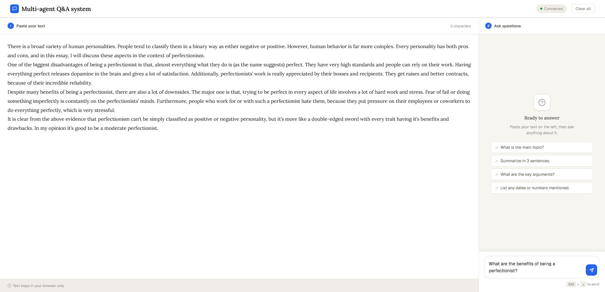
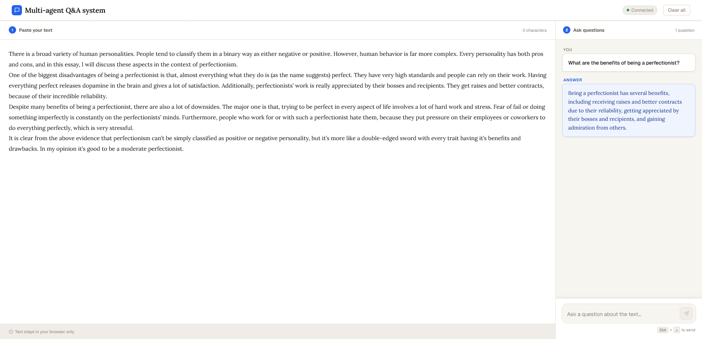
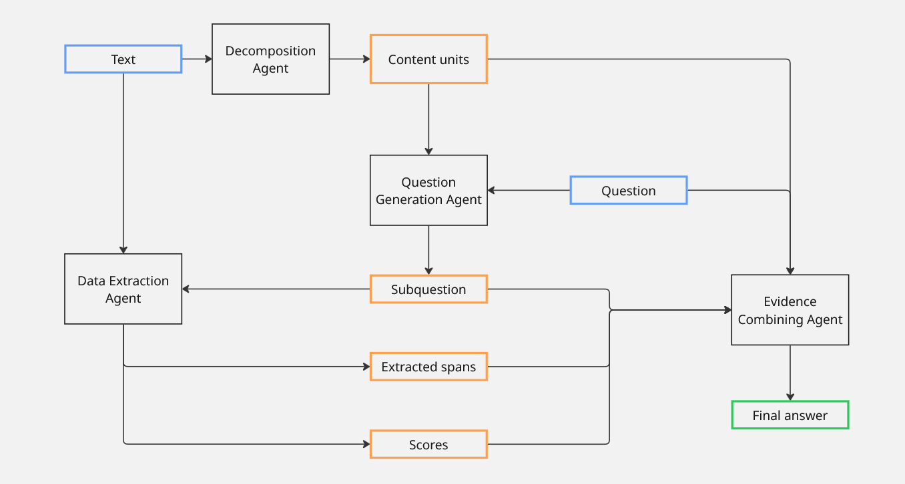

# Multi-Agent Q&A System

A production-deployed question-answering system that uses a pipeline of specialized AI agents to answer questions about any text — minimizing hallucinations through extractive evidence retrieval.

🔗 **Live demo:** [qna-558577997211.europe-west1.run.app](https://qna-558577997211.europe-west1.run.app/)

---

## What it does

Paste any text (article, research paper, report, email, contract) and ask questions about it in natural language. The system decomposes your question, retrieves supporting evidence directly from the source text, and synthesizes a grounded answer — without making things up.

---

## How to use it

**Step 1 — Open the app**

The interface has two panels: paste your text on the left, ask questions on the right. You can use the suggested prompts or write your own.

---

**Step 2 — Paste your text**

Once text is detected, the status bar shows `Ready`. The text never leaves your browser until you send a question — it is not stored server-side.

---

**Step 3 — Ask a question**

Type any question about the text and press `Ctrl + Enter` (or the send button) to submit.

---

**Step 4 — Get an answer**

The system returns a concise, evidence-grounded answer synthesized from relevant spans extracted directly from your text.

---

## Agent Architecture

The system uses four specialized agents arranged in a pipeline. Each agent has a focused role, which keeps individual prompts simple and the overall system reliable.

| Color | Meaning |
|---|---|
| 🔵 Blue | Input data (text, question) |
| 🟠 Orange | Intermediate data exchanged between agents |
| ⬛ Black | Agents |
| 🟢 Green | Final output (answer) |

### Pipeline walkthrough

**1. Decomposition Agent**
Takes the raw input text and breaks it into atomic *content units* — discrete facts and claims. This gives downstream agents a structured view of the document rather than raw prose.

**2. Question Generation Agent**
Receives the content units and the user's question, then generates focused *subquestions* — each targeting a specific aspect of the original question that can be answered from a single content unit. This ensures coverage and higher chance of finding the answer.

**3. Data Extraction Agent** *(runs asynchronously)*
For each subquestion, extracts the most relevant *span* directly from the source text along with a confidence *score*. This agent is **extractive, not abstractive** — it returns verbatim passages rather than generated text, which substantially reduces hallucinations. All subquestion extractions run in parallel to minimize latency.

**4. Evidence Combining Agent**
Receives the original question, all subquestions, their extracted spans, and confidence scores, and synthesizes a final coherent answer. Because the evidence is grounded in exact quotes from the source, the model is constrained to what the text actually says.

---

## Technical Stack

| Layer | Technology |
|---|---|
| Backend | Python, Flask |
| AI models | HuggingFace Inference API |
| Hosting | Google Cloud Run |
| Containerization | Docker |
| CI/CD | GitHub → Google Cloud Build |
| Frontend | HTML, CSS, JavaScript |

### Key design decisions

**Asynchronous extraction** — Data Extraction Agent calls to the HuggingFace API are dispatched concurrently (one per subquestion) using Python's `asyncio`. This reduces total latency roughly proportionally to the number of subquestions, compared to sequential execution.

**Extractive evidence retrieval** — The Data Extraction Agent uses an extractive QA model (span selection) rather than a generative model. This anchors answers in exact source passages, reducing the risk of the model confabulating information not present in the text.

**Prompt-engineered chat agents** — The Decomposition, Question Generation, and Evidence Combining agents are built on chat completion endpoints with carefully designed system prompts that constrain each agent to its specific task.

**CD pipeline** — The repository is connected to Google Cloud Build via a trigger on the main branch. Pushing to GitHub automatically builds a new Docker image, pushes it to Artifact Registry, and deploys a new revision to Cloud Run — with zero manual steps required.

---

## Notes

- The application processes text **client-side until submission** — text is not stored or logged.
- The system works best on factual, information-dense texts in English (articles, papers, reports, contracts).
- Response quality degrades on very short texts or highly abstract/opinion-based questions where extractive evidence is sparse.
- Sometimes there is an error with hugging face and you have to resend the question, to get the answer.
